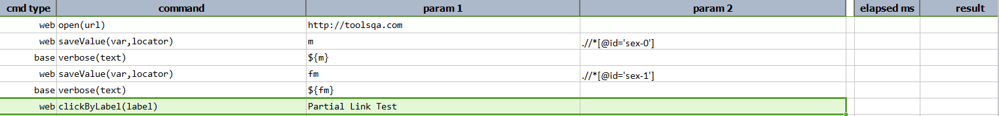
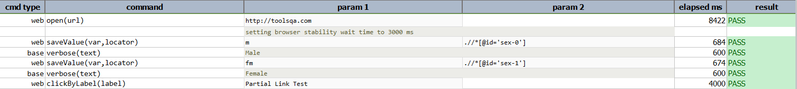

### Description

- This command is to click the element by label.
- In other words the command will click on the element as per the label of the element provided as input.
- The command will click element if found and pass or else fail otherwise.

### Parameter(s)

- **label** - this actual label name displayed for the element.

### Example

Script: 

Output: 

### See Also

- [`click(locator)`](click(locator).html)
- [`clickByLabelAndWait(label,waitMs)`](clickByLabelAndWait(label,waitMs).html)