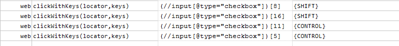
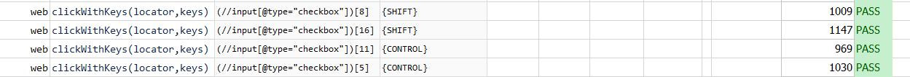

### Description
This command clicks on the target element as specified via `locator` with the keystrokes of control (modifier) keys 
specified via `keys`.  The specified control keys are pressed while performing the clicking on the target web element.

If `locator` does not resolve to a valid web element, this command will consider it as a FAIL.  If keystroke is empty 
(such as `(empty)`), this command will be equivalent to [web &raquo; `click(locator)`](click(locator)). If `keys` 
contains duplicate/repeated control keys, the key press action for such key will happen only once.

For example, if the intent is to select multiple rows (of a table), one would perform `CONTROL` + click on each target 
element.  As such one can use this command on all the target elements with `keys` set to `{CONTROL}`. If the intent is 
to select a contiguous block of rows, one would usually use `SHIFT` + click on the first and last element of the block.
 Similarly, one can apply this command to the first and last element with `keys` set to `{SHIFT}`.

The supported key or combination of keys are:
```
{SHIFT}
{CONTROL}
{ALT}
{META}
{WIN}
{COMMAND}
```


### Parameters
- **locator** - this parameter is the xpath of the element on which action need to be performed.
- **keys** - this parameter is control keys to be pressed while clicking on element.


### Example
**Script**:<br/>


**Output**:<br/>


Above script will first select 8th to 16th row with `SHIFT` + click for first two rows, then it will deselect 11th row 
with `CONTROL + click` as it was already selected with `SHIFT` key. Then it will select 5th row with `CONTROL` + click 
key.


### See Also
- [`click(locator)`](click(locator))
