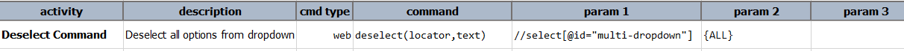
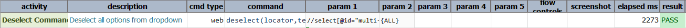
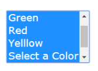
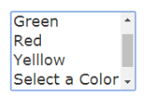

### Description
This command automates the deselection of `OPTION` element(s) from a `SELECT` element identified via `locator`. The
target `OPTION` element is identified via `text`, which could be plain text for single element identification (i.e. 
exact match) or regex-based element identification (i.e. multi-match).  Visit the 
[Note section of `select(locator,text)`](select(locator,text).html#note) for more technical details.

### Note
- Now suppose we have select element with `multi-select`. So to deselect all the options selected from dropdown, 
  one would specify **`text` as `{ALL}`.**

### Parameters
- **locator** - this parameter is the locator of the `SELECT` element.
- **text** - this parameter is the text to be deselected from the `SELECT` element. In case of multi-select,
   support `{ALL}` to deselect all options.

### Example
**script:-** 

**output:-** 

|After Selection         |After Deselection         |
|------------------------|--------------------------|
|||

### See Also
- [`deselectMulti(locator,array)`](deselectMulti(locator,array))
- [`select(locator,text)`](select(locator,text))
- [`selectMulti(locator,array)`](selectMulti(locator,array))
- [`selectMultiOptions(locator)`](selectMultiOptions(locator))
- [`type(locator,value)`](type(locator,value))
