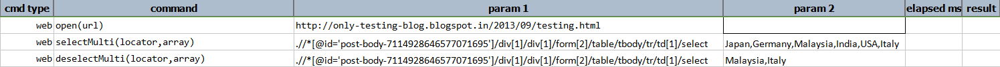
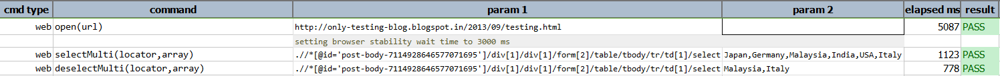

### Description

- This command is to deselect the selected item from the listbox.
- In other words this command will unselect the item from the listbox as defined as input parameter.
- The command will identify the element deselect the element is it is selected and pass or else fail otherwise.

### Parameters

- **locator** - this parameter is the locator of the element.
- **array** - this parameter is the list of the item to be unselected from the listbox.

### Example

**Output**: 

### See Also

- [`selectMultiOptions(locator)`](selectMultiOptions(locator))