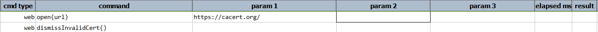
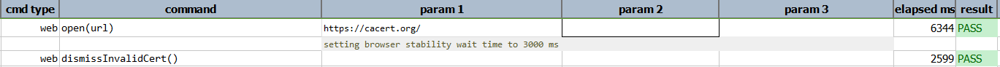

### Description

- This command is to dismiss the invalid certificate for any website.
- In other words if there is any unsecured websites with invalid certificate, this command will dismiss invalid certificate and pass or else fail otherwise.
- This command does not require any input parameters

### Example

**Script**: 

**Output**: 

### See Also

- [`open(url)`](open(url))
- [`dismissInvalidCertPopup()`](dismissInvalidCertPopup())