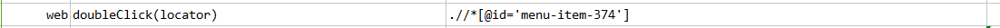
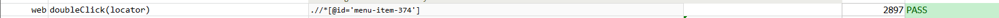

### Description

- This command is to double  click element on the page as per the locator.
- The command requires xpath locator of the button element on the page.

### Parameters

- **locator** - this parameter is the xpath of the element on which action need to be performed.

### Example

**Script**: 

**Output**: 

### See Also

- [`click(locator)`](click(locator))
- [`doubleClickAndWait(locator,waitMs)`](doubleClickAndWait(locator,waitMs))