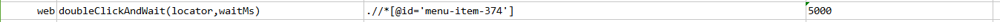
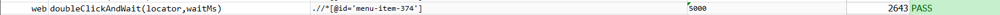

### Description

*   This command is to double  click element on the page as per the locator and wait for time defined as input parameter.
*   The command requires xpath locator of the button element on the page

### Parameter(s)

- **locator** - this parameter is the locator of the element.
- **waitMs** - this parameter is the time to wait after click

### Example

Script:

Output:

### See Also

*   [`doubleClick(locator)`](doubleClick(locator))
*   [`click(locator)`](click(locator))