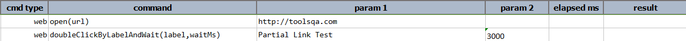
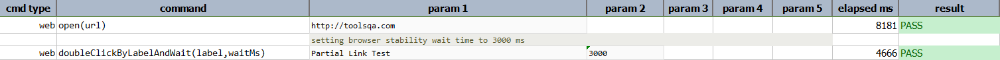

### Description

- This command is to double click the element by label and wait for the desired time defined as input parameters.
- In other words the command will double click on the element as per the label defined and wait.
- The command will double click the element if found and pass or else fail otherwise.

### Parameters

- **label** - this parameter is actual label name displayed for the element.
- **waitMs** - this parameter is the time to wait(time should be defined in milliseconds)

### Example

**Output**: 

### See Also

- [`doubleClickByLabel(label)`](doubleClickByLabel(label))
- [`clickByLabelAndWait(label,waitMs)`](clickByLabelAndWait(label,waitMs))