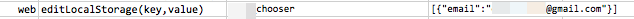

### Description

- This command set (possibly overwrite) the current browser's local storage with the key-value specified.  
- Existing key will be overwritten.  
- With no value is specified - denoted as `(empty)` - then the specified `key` will be removed from the local storage.

### Parameters

- **key** - the name in local storage to which the specified `value` will be saved.
- **value** - the value to store in local storage.

### Example

### See Also

- [`clearLocalStorage()`](clearLocalStorage())
- [`saveLocalStorage(var,key)`](saveLocalStorage(var,key))