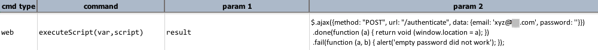

### Description

This command allows the execution of an arbitary Javacript on the current browser, whatever page is currently on display.  This can be particularly useful in 2 areas:

1.  Web Security Test  
    Using Javascript to expose weakness of the target Web application.  Techniques such as cross-site script, cookie tainting, framework-specific vulnerability attack are just some of the possible strategies that can be applied here.  For example, one can execute a snippet of JavaScript code to mimic the communication to the backend application, without the JavaScript-based validations or controls.  Or, one can introduce new variants of request parameters to test the vulnerability of the backend application in terms of data validation.
2.  Exposing internal state of Web application  
    At times it might be useful to retrieve one or more application states at the JavaScript-level.  For example, we can use this command to retrieve the version of JQuery used by a Web application.

### Parameters

- **var** - the variable to hold any return value from the executed script.
- **script** - the script to execute.  Note that Nexial does not provide any syntactical or semantic validation of the script.

### Example

**Script**: 

**Output**: 
The script would execute and the browser thus react accordingly

### See Also