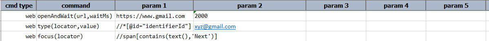
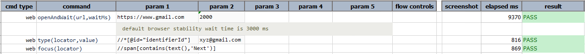

### Description

This command will place focus on the first element that matches specified locator. 

**Note**: If the matched element is a textbox or textarea, Nexial will also automate a  click to put the cursor on the target INPUT element.

### Parameters

- **locator** - This parameter is the locator(xpath) of the element.

### Example

**Script**: 

**Output**: 

