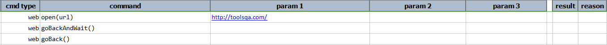

### Description
This command will navigate back to previous page.  Due to underlying webdriver support, this command does not 
work for Electron application.
    

### Example

Output

### See Also
- [`goBackAndWait()`](goBackAndWait())