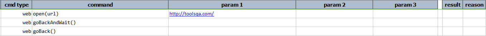
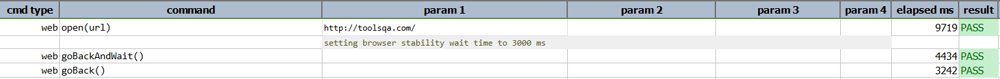

### Description

- This command will navigate back to previous page and wait for default 3000 milliseconds.
- In other words the command will navigate back to previous page and wait for 3000 milliseconds and pass or else fail otherwise.
- This command does not require any input parameters.  
      
    

### Example

**Script**: 

Output

### See Also

- [`goBack()`](goBack())
