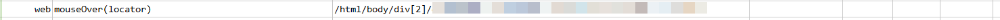
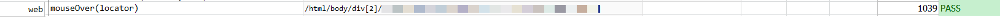

### Description

- This command will move the mouse to the desired element or control as per the locator defined.
- In other words the mouse will move to the element if found or else fail otherwise.

### Parameters

- **locator** - this parameter is locator(xpath) of the element to be identified.

### Example

**Script**: 

**Output**: 

### See Also

- [`web`](index)