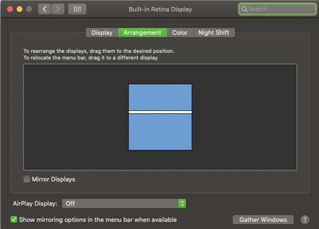
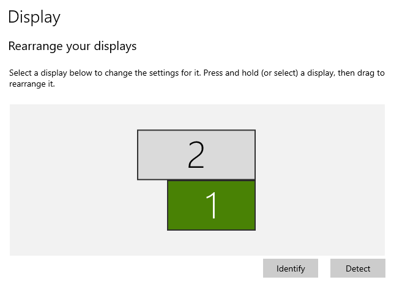

### Description
This command instructs Nexial to move current browser window to a specific position (denoted by `x` and `y`) based on 
the current primary display.

The idea with the `x` and `y` parameters is to provide pixel-based coordinate of the top-left corner of the current
browser window. Hence,
```
io | moveTo(x,y) | 0 | 0
``` 
... means to move the current browser window to the the top-left corner of current primary display. 

For a display with screen resolution of 1280x960, 
```
io | moveTo(x,y) | 640 | 0
``` 
... means to move the current browser window to the middle of the current primary display while vertically align to 
the top of the screen.

**A note about "primary display":**<br/>
When working with multiple computer monitors (very common these days), it is important to note that one of the display
is considered as the "primary" display. It is from this primary display that the `x` and `y` coordinates are based. 
Thus the coordinate `(0,0)` means the top-left corner of the primary display. To reference a coordinate of a secondary
display, one would need to specify the `x` and `y` values relative to the primary display.

For example, here's a screenshot of a dual display configuration for a Mac laptop:<br/>


Here the primary display (top) has a screen resolution of 2560x1080, while the secondary display (bottom) has a 
screen resolution of 2560x1600. In order to move the current browser window to the second display, one would need to
issue the following:<br/>
```
io | moveTo(x,y) | 0 | 1081
``` 

Here's another screenshot of a dual display configuration - this time for a Windows 10 laptop:<br/>


The primary display is on the bottom, and it is set to 1920x1080. The secondary display is on the top and it is set to
2560x1080. In order to move the current browser window to the top-left corner of the second display, one would need to  
issue the following:<br/>
```
io | moveTo(x,y) | -640 | -1080
```

A good practical use of this command is to rearrange browser window(s) such that multiple browser windows would display
without overlapped.


### Parameters
- **x** - the x-coordinate, in pixel, to move the current browser window
- **y** - the y-coordinate, in pixel, to move the current browser window


### Example


### See Also
