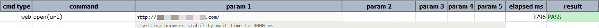

### Description

- This command is to open the desired URL.
- This command will open the URL in desired URL defined in the data file.

### Parameters

- **url** - this parameter is the URL to be opened.

### Example

**Script**: 

**Output**: 

### See Also

- [`web`](index)