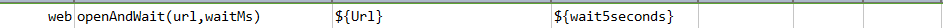
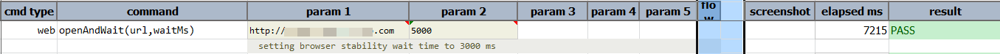

### Description
This command will issue web request defined as `url`. If `waitMs` millisecond has passed and the request is not 
completed, this command will consider it as FAIL.

### Parameters
- **url** - this parameter is the wep page  to be opened.
- **waitMs** - this parameter is the time to wait after opening the page.

### Example
**Script**: 

**Output**: 

### See Also
- [`open(url)`](open(url))
- [`openHttpBasic(url,username,password)`](openHttpBasic(url,username,password))
- [`openIgnoreTimeout(url)`](openIgnoreTimeout(url))