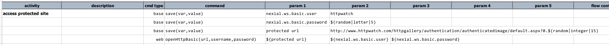
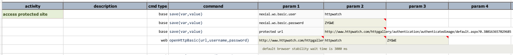

### Description
This command opens the target `url` by applying HTTP basic authentication using the supplied credential (e.g. 
`username` and `password`). This command issue the "open" request on current window. However this command makes no 
attempt to interpret the outcome of issue the supplied `url` and credential.

### Parameters
- **url** - this parameter is the URL to be opened.
- **username** - the username for HTTP Basic authentication.
- **password** - the password for HTTP Basic authentication.

### Example
**Script**: 

**Output**: 

Note that the use of `nexial.ws.basic.user` and `nexial.ws.basic.password` are not necessary towards this command. The
example above were pulled from another example.

### See Also
- [`open(url)`](open(url))
- [`openAndWait(url,waitMs)`](openAndWait(url,waitMs))
- [`openIgnoreTimeout(url)`](openIgnoreTimeout(url))