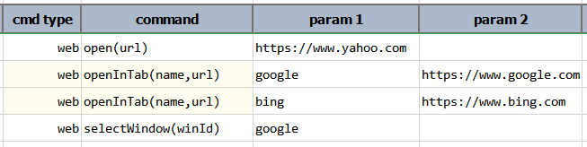

### Description
This command instructs Nexial to open `url` in another tab named as specified (i.e. `name`). If no such tab exists, a
new tab will be created in the current window. 

It'd be prudent to specify a meaningful name for the tab target (`name`) so that you can use it to switch between tabs
via [web &raquo; `selectWindow(winId)`](selectWindow(winId)) command. Note that if `name` is not specified, one will be 
generated as follows (probably not the most useful name): `[project-name].[run-id].[counter]`.

This command put focus on the specified tab while opening the specified `url`. To switch back to previous tab or another
tab, use one of the `selectWindow` commands ([See Also](#see-also) for detail).

### Parameters
- **name** - the tab name to open the specified URL.
- **url** - the URL to be opened.

### Example
Below is an example script that opens a URL (yahoo.com), and then opens up 2 additional tabs (google.com, then bing.com).
After all 3 URLs are opened, the script switches focus back to the second tab (`google`) in Step 4.

**Script**: 

**Output**: 
Click play to see the automation in action. 

<video width="850" height="*" controls>
  <source src="image/openInTab_02.mp4" type="video/mp4">
Your browser does not support the video tag.
</video>
 

### See Also
- [`open(url)`](open(url))
- [`selectWindow(winId)`](selectWindow(winId))
- [`selectWindowAndWait(winId,waitMs)`](selectWindowAndWait(winId,waitMs))
- [`selectWindowByIndex(index)`](selectWindowByIndex(index))
- [`selectWindowByIndexAndWait(index,waitMs)`](selectWindowByIndexAndWait(index,waitMs))
- [`openAndWait(url,waitMs)`](openAndWait(url,waitMs))
