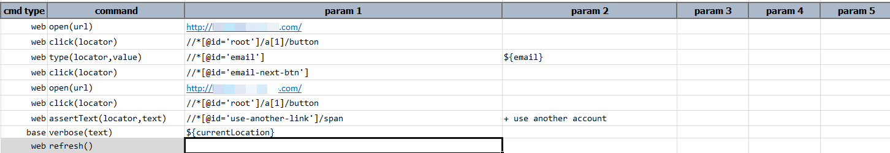
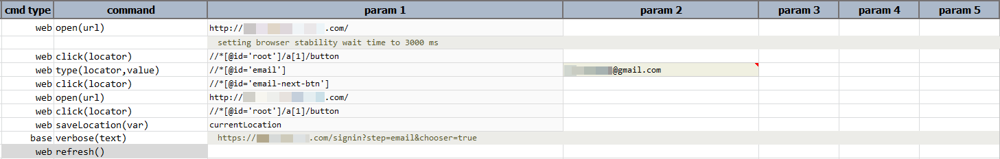

### Description

- This command is to refresh the active browser.
- In other words this command will refresh the browser and pass or else fail otherwise if not active browser found to be refreshed.
- No input parameter required for this command.

### Parameters

### Example

**Script**: 

**Output**: 

### See Also

- [`open(url)`](open(url))