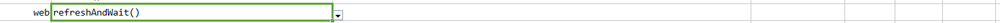

### Description

- This command will refresh the active browser and wait for 30 seconds.
- In other words the command will refresh the browser and wait for 30 seconds.
- The command will refresh and pass if active browser found or else fail otherwise.
- No input parameter required for this command

### Parameters

### Example

Script: 

Output: 

### See Also

- [`open(url)`](open(url))
- [`refresh()`](refresh())
- [`web`](index)