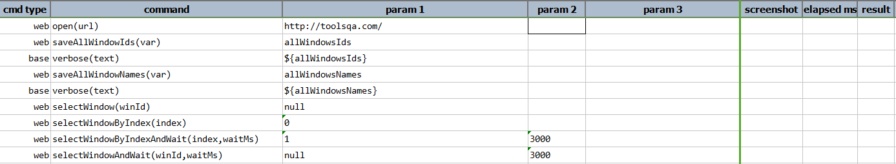
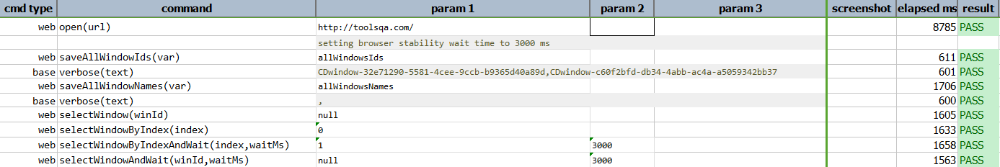

### Description

- This command will save all ID of all open windows/tabs of the current browser instance.  These IDs are saved as an array to the specified `var` variable.  If the current browser is not active or has been completely shut down, then no data will be saved to the specified `var` variable.

### Parameters

- **var** - this parameter is the variable to store all active browser window ids.

### Example

**Script**: 

**Output**: 

### See Also

- [`saveAllWindowNames(var)`](saveAllWindowNames(var))
- [`selectWindow(winId)`](selectWindow(winId))
- [`selectWindowByIndex(index)`](selectWindowByIndex(index))
- [`selectWindowByIndexAndWait(index,waitMs)`](selectWindowByIndexAndWait(index,waitMs))
- [`selectWindowAndWait(winId,waitMs)`](selectWindowAndWait(winId,waitMs))