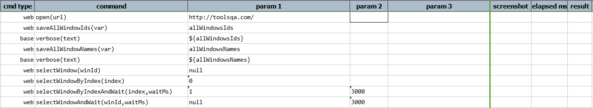
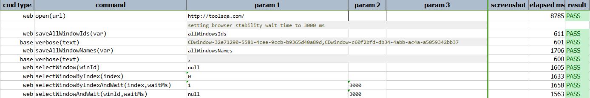

### Description

- This command will save all the active session window names (if any). If no browser instance is running, no data will be saved to the specified `var` variable.

### Parameters

- **var** - this parameter is the variable where name of the browser windows are stored.

### Example

**Script**: 

**Output**: 

### See Also

- [`selectWindow(winId)`](selectWindow(winId))
- [`selectWindowByIndex(index)`](selectWindowByIndex(index))
- [`selectWindowByIndexAndWait(index,waitMs)`](selectWindowByIndexAndWait(index,waitMs))
- [`selectWindowAndWait(winId,waitMs)`](selectWindowAndWait(winId,waitMs))