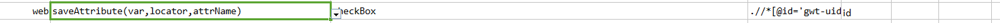
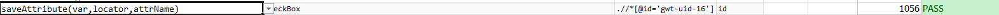

### Description
This command captures the attribute value of the first element to match specified `locator` and save it to `var`. The
attribute name is denoted as `attrName`.

Suppose the following HTML:<br/>
```html
<div id="myDiv" data-bind="company.person.name">...</div>
```

With the following command:<br/>
`web | saveAttribute(var,locator,attrName) | myVar | css=#myDiv | data-bind`

Now the data variable `myVar` would contain the value `company.person.name`.


### Parameters
- **var** - the data variable name to store the attribute values found for the first matching element.
- **locator** - locator of the target element.
- **attrName** - the target attribute name of the element.


### Example
**Script**:<br/>


**Output**:<br/>



### See Also
- [`assertAttribute(locator,attrName,value)`](assertAttribute(locator,attrName,value))
- [`assertAttributeContain(locator,attrName,contains)`](assertAttributeContain(locator,attrName,contains))
- [`assertAttributeNotContain(locator,attrName,contains)`](assertAttributeNotContain(locator,attrName,contains))
- [`assertAttributeNotPresent(locator,attrName)`](assertAttributeNotPresent(locator,attrName))
- [`assertAttributePresent(locator,attrName)`](assertAttributePresent(locator,attrName))
- [`saveAttributeList(var,locator,attrName)`](saveAttributeList(var,locator,attrName))
- [`updateAttribute(locator,attrName,value)`](updateAttribute(locator,attrName,value))
