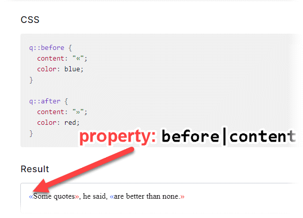

### Description
This command store the value of a CSS `property` to a variable for a given web element denoted by `var`. Note that
the CSS value is the "computed" value, as interpreted and consolidated by the underlying browser upon the assigned CSS
class and inline `style` attribute. As such, some CSS value will be rendered slightly differently. In particular, color
properties are rendered either as `rgb(hex, hex, hex)` or `rgba(hex, hex, hex, alpha)` forms.



As of [Nexial v4.4](../../release/nexial-core-v4.4.changelog), Nexial supports the use of CSS pseudo class in this 
command. This can be extremely helpful to obtain the CSS value bound to a 
<a href="https://developer.mozilla.org/en-US/docs/Web/CSS/Pseudo-classes" class="external-link" link="nexial_link">pseudo class</a>
of the target element, which often cannot be referenced directly via its locator. To reference a pseudo class, use the
`pseudo class|property name` syntax in the `property` parameter. Note that the System variable 
[nexial.web.useComputedCss](../../systemvars/#nexial.web.useComputedCss) should be set to `true` in order for Nexial to
return the computed CSS values, rather than the defined CSS value.

Consider the following example:


In this example, the element represented by `q` has a `:before` and `:after` pseudo class, each with a unique set of 
CSS properties. To reference the `content` CSS value of the `before` pseudo class, one would invoke this command as:
```
web >> saveCssValue(var,locator,property)  |  myVar  |  css=q  |  :before|content 
```

To reference `color` CSS value of the `after` pseudo class instead:
```
web >> saveCssValue(var,locator,property)  |  myVar  |  css=q  |  after|color 
```

Note that the colon before the pseudo class name is optional; `before:content` and `:before:content` are both valid.


### Parameters
- **var** - the data variable to store the collected CSS value
- **locator** - this parameter is the locator(xpath) of the element
- **property** - this parameter is the css property of the element


### Example


### See Also
- [`assertAttributePresent(locator,attrName)`](assertAttributePresent(locator,attrName))
- [`assertCssNotPresent(locator,property)`](assertCssNotPresent(locator,property))
- [`assertCssPresent(locator,property,value)`](assertCssPresent(locator,property,value))
- [`saveAttribute(var,locator,attrName)`](saveAttribute(var,locator,attrName))
- [`saveAttributeList(var,locator,attrName)`](saveAttributeList(var,locator,attrName))
