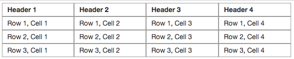
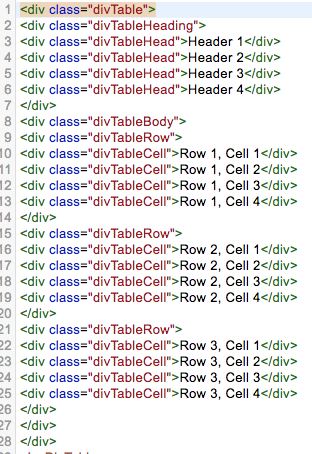

### Description
This command automates the collection of cell data found a DIV-based data grid.  Such grid is a table-like structure 
represented by layers of `DIV` elements. Below is an example of data grid made up of `DIV` elements: 

 
 

This form of grid structure differs from the conventional `<TABLE>` construct, where `<TR>`, `<TH>` and `<TD>` tags are 
used to represent "row", "header cell" and "data cell" respectively.  `DIV` data grid, on the other hand, uses 
predominantly `
` tags to represent all the common construct of a grid (or table). The underlying design decision
aside, `DIV` data grid poses some challenges in terms of data harvesting since one would need to distinct the different
uses of `
` tags within a grid.

This command thus requires the following locators in order to effectively and accurately collect data from a `DIV` 
data grid:

- `headers`: the **locator** that represents all instances of "header cells" (NOTE: not the "row" that houses the 
  headers). If no header is available, use `(null)`, `(empty)` or `(blank)` instead.
- `rows`: the **locator** that represents each of the data rows.
- `cells`: the **relative locator** that represents all the cells within one row. This locator will be applied within 
  the hierarchy of a "row" instance, which is based on the `rows` locator.
- `nextPage`: the **locator** that would activate the subsequent page view of the same data grid. This parameter is 
  optional as not all data grid supports the use of pagination. If pagination is not implemented, use `(null)`, 
  `(empty)` or `(blank)` for this parameter. If `nextPage` locator is provided, Nexial will automatically "forward" to 
  the next page view when the data of the current page is collected. 
- `file`: the fully qualified path for the CSV output.

The CSV output will be constructed using field delimiter as defined by 
[`nexial.textDelim`](../../systemvars/index#nexial.textDelim) and `\n` as record delimiter.

Note that:
- The `nextPageLocator` is optional. Specifying it as `(empty)` or `(blank)` would disable any pagination automation.
- Nexial will not attempt to "rewind" the pagination back to the initial or first page.



### Parameters
- **headers** - locator of the header cell instances.
- **rows** - locator of the data row instances.
- **cell** - relative locator of the cell instances within one row.
- **nextPageLocator** - locator of component that would forward the pagination
- **file** - the location of the CSV file

### Example

### See Also
- [`assertTable(locator,row,column,text)`](assertTable(locator,row,column,text))
- [`saveInfiniteDivsAsCsv(config,file)`](saveInfiniteDivsAsCsv(config,file))
- [`saveInfiniteTableAsCsv(config,file)`](saveInfiniteTableAsCsv(config,file))
- [`saveTableAsCsv(locator,nextPageLocator,file)`](saveTableAsCsv(locator,nextPageLocator,file))
