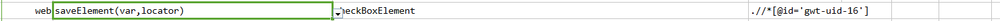

### Description

- This command is to save element into variable to be used for future usage.
- In other words using this command elements can be saved into variable as per defined locator.

### Parameters

- **var** - this parameter is to store the element found as per the locator.
- **locator** - this parameter is locator(xpath) of the element to be found on page.

### Example

**Script**: 

**Output**: 

### See Also

- [`saveAttribute(var,locator,attrName)`](saveAttribute(var,locator,attrName))
- [`web`](index)