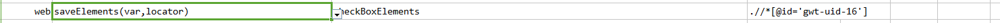
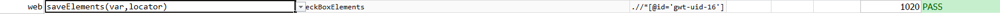

### Description

- This command is to save multiple elements into variable to be used for future usage.
- In other words using this command if there are multiple elements found as per defined locator then those can be saved into variable.

### Parameters

- **var** - this parameter is to store the element found as per the locator.
- **locator** - this parameter is locator of the element

### Example

**Script**: 

**Output**: 

### See Also

- [`saveElement(var,locator)`](saveElement(var,locator))
- [`web`](index)