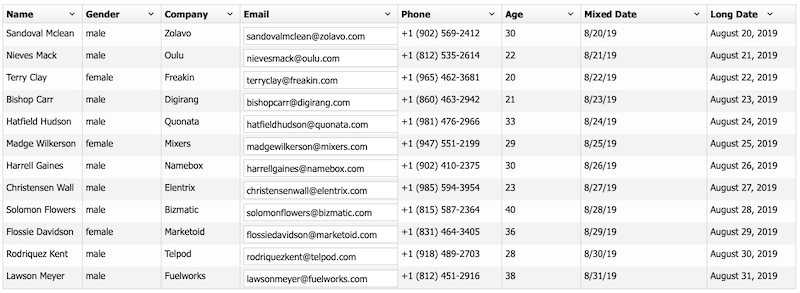
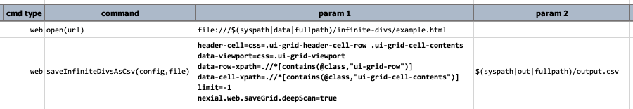
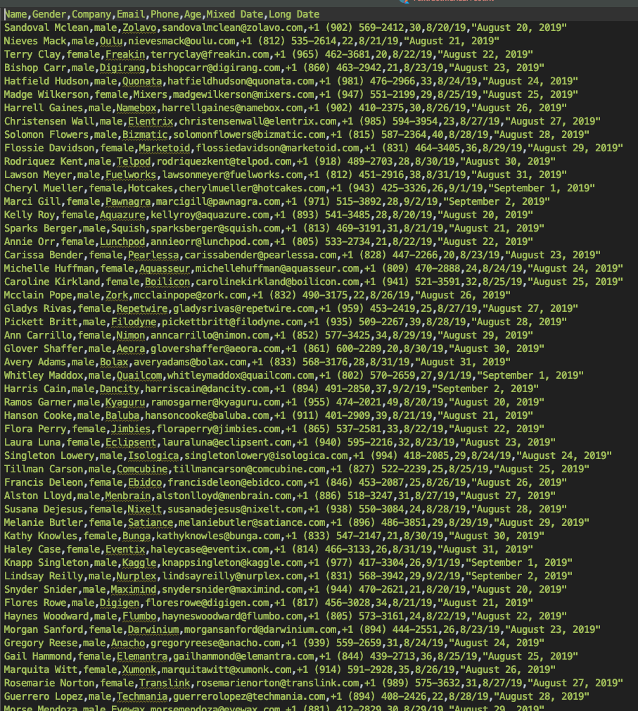

### Description
This command automates the collection of grid data found in an 
<a href="https://www.nngroup.com/articles/infinite-scrolling/" class="external-link" target="_nexial_external">"infinite scrolling"</a> 
table into a CSV `file`. This command assumes that the data grid is constructed via the `
` construct.  As 
with most CSV-related features in Nexial, the field delimiter is determined via the 
[`nexial.textDelim`](../../systemvars/index#nexial.textDelim) System variable.

Example of an infinite scrolling table constructed via `
`: 

For infinite scrolling grid constructed via `<TABLE>`, see 
[`saveInfiniteTableAsCsv(config,file)`](saveInfiniteTableAsCsv(config,file)) command.





### Parameters
- **`config`** - the configuration to use when collect grid data from an Infinite Scrolling table.
- **`file`** - the CSV file location to capture the grid data.

### Example
Suppose we want to capture the grid data in this Infinite Scrolling `
` (contains 200 rows): 

**Script**: 

**`output.csv`**: 
(truncated for brevity)

### See Also
- [`saveDivsAsCsv(headers,rows,cells,nextPage,file)`](saveDivsAsCsv(headers,rows,cells,nextPage,file))
- [`saveInfiniteTableAsCsv(config,file)`](saveInfiniteTableAsCsv(config,file))
- [`saveTableAsCsv(locator,nextPageLocator,file)`](saveTableAsCsv(locator,nextPageLocator,file))
