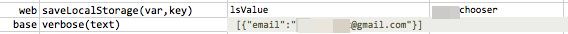

### Description

- This command save the value of a local storage (based on `key`) to the specified `var`.  
- If the identified `key` does not resolve to a value (i.e., not found), the specified `var` will be save with no value.

### Parameters

- **var** - the name of the variable to save the value of the specified local storage `key`.
- **key** - the `key` in the current browser's local storage.

### Example

the current browser's local storage has a key named as `__chooser`, with value set to `{"email":"iamtest@[gmail.com"}. 

### See Also

- [`clearLocalStorage()`](clearLocalStorage())