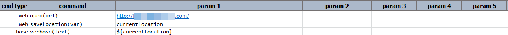
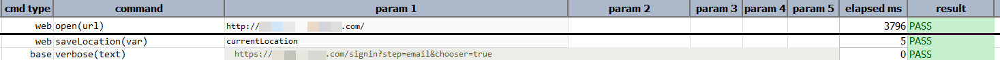

### Description

- This command is to save the current active location of the web page.
- The variable can be defined to save the page location to be used for later usage in the test.

### Parameters

- **var** - this parameter is the variable where the current location of the web page is save.

### Example

**Script**: 

**Output**: 

### See Also

- [`open(url)`](open(url))
- [`openAndWait(url,waitMs)`](openAndWait(url,waitMs))