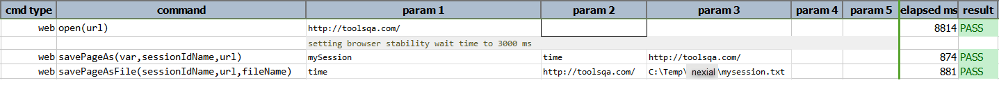

### Description
This command saves the content of a URL into variable. One can use `sessionIdName` to selectively pass on specific
cookie name/value pair from current web page into the request of the `url`. If no session cookie is available or 
required, one can specify `(null)` or `(blank)` for `sessionIdName`.

The content of the specified `url`, if successfully downloaded, will be saved as text to the specified `var`.

### Parameters
- **var** - this parameter is a variable to store the session.
- **sessionIdName** - name of the session cookie, if any, to pass from current web page to the specified `url`.
- **url** - the url from which the content would be saved to `var`.

### Example
**Script**: 

**Output**: 
 

### See Also
- [`savePageAsFile(sessionIdName,url,file)`](savePageAsFile(sessionIdName,url,file))
