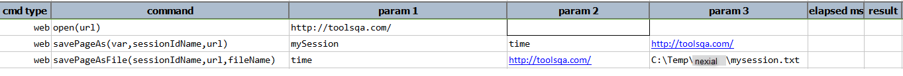

### Description
This command saves the content of a URL into a file (denoted by `file`). One can use `sessionIdName` to selectively 
pass on specific cookie name/value pair from current web page into the request of the `url`. If no session cookie is 
available or required, one can use `(null)` or `(blank)` for `sessionIdName`.

The content of the specified `url`, if successfully downloaded, will be saved as text to the specified `file`. Note 
that fully qualified path for `file` is assumed.

### Parameters
- **sessionIdName** - name of the session cookie, if any, to pass from current web page to the specified `url`.
- **url** - the url from which the content would be saved to `file`.
- **file** - the fully qualified file to save the content of `url`.

### Example
**Script**: 

**Output**: 

### See Also
- [`savePageAs(var,sessionIdName,url)`](savePageAs(var,sessionIdName,url))
