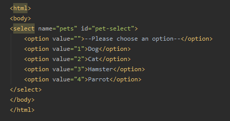
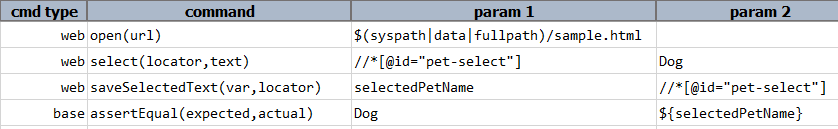
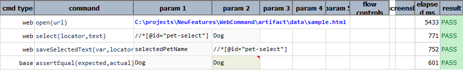
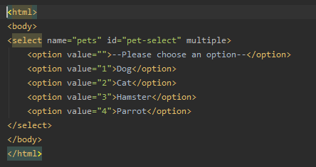
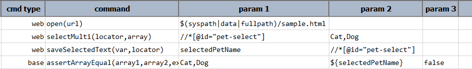
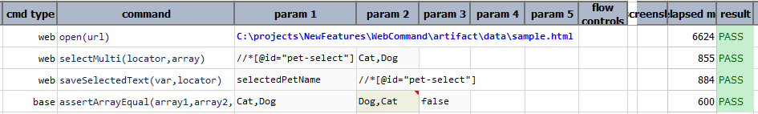

### Description

This command will get the selected text in a web `select` element identified via the specified `locator` and
store to user defined variable specified via `var`.

**Note**: This command will store the array of selected text from the **`multi-select`** list box.

### Parameters

- **var** - this parameter is to store the value into variable.
- **locator** - this parameter is locator(xpath) of the element.

### Example

    <ul class="tab-links tabs-collapsed">
        <li class="active"><a href="#tab1">Single-select Element</a></li>
        <li><a href="#tab2">Multi-select Element</a></li>
    </ul>
    

        

        <b>Sample HTML:</b> 
            
        <b>Data file:</b> 
            
        <b>Output:</b> 
             
        

        

        <b>Sample HTML:</b> 
            
        <b>Data file:</b> 
            
        <b>Output:</b> 
             
        

    

### See Also

- [`saveText(var,locator)`](saveText(var,locator))
- [`saveValue(var,locator)`](saveValue(var,locator))
- [`saveSelectedValue(var,locator)`](saveSelectedValue(var,locator))
