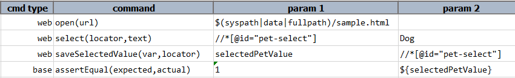
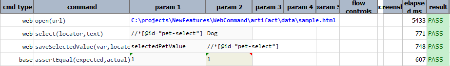
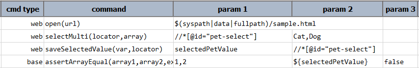
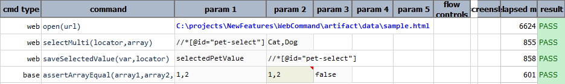

### Description
This command is to save the selected option value of a web `select` element to a user defined variable via `var`.
This "value" mentioned here is equivalent to the "value" attribute of the selected option of the corresponding 
`select` element identified via the specified `locator`.

**Note**: This command will store the array of selected option values from the **`multi-select`** list box. 

### Parameters

- **var** - this parameter is to store the value attribute of selected option in `select` element.
- **locator** - this parameter is the locator of the select element.

### Example

    <ul class="tab-links tabs-collapsed">
        <li class="active"><a href="#tab1">Single-select Element</a></li>
        <li><a href="#tab2">Multi-select Element</a></li>
    </ul>
    

        

        <b>Sample HTML:</b> 
            
        <b>Data file:</b> 
            
        <b>Output:</b> 
             
        

        

        <b>Sample HTML:</b> 
            
        <b>Data file:</b> 
            
        <b>Output:</b> 
             
        

    

### See Also

- [`saveText(var,locator)`](saveText(var,locator))
- [`saveValue(var,locator)`](saveValue(var,locator))
- [`saveSelectedText(var,locator)`](saveSelectedText(var,locator))
