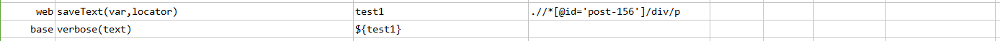
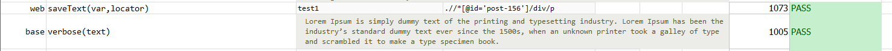

### Description

- This command is to get the text from element and save to the variable to be used for future reference in test.
- In other words this command will get the text from the element and will store to the user defined variable.

### Parameters

- **var** - this parameter is to store the value into variable.
- **locator** - this parameter is locator(xpath) of the element.

### Example

**Script**: 

**Output**: 

### See Also

- [`assertElementPresent(locator)`](assertElementPresent(locator))
- [`saveTextSubstringAfter(var,locator,delim)`](saveTextSubstringAfter(var,locator,delim))
- [`saveTextSubstringBefore(var,locator,delim)`](saveTextSubstringBefore(var,locator,delim))