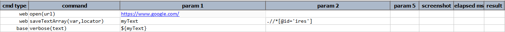
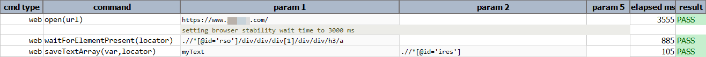

### Description

- This command is to save the all the text into array Variable.
- In other words this command will store the text of the elements returned by the locator into Array variable.
- If any locator which returns multiple element, then this command can be used to get the text of all the elements.
- All the text return form the element are stored and returned to user in array list.

### Parameters

- **var** - this parameter is to store the variable of the element.
- **locator** - this parameter is the locator of the element.

### Example

**Script**: 

**Output**: 

### See Also

- [`saveText(var,locator)`](saveText(var,locator))