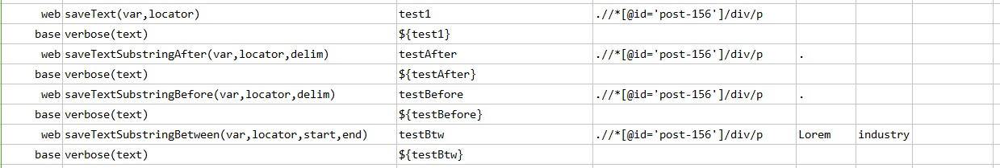
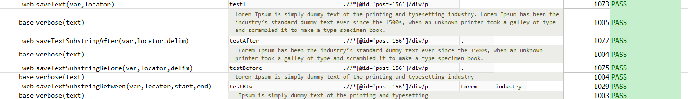

### Description

- This command is to sub string the text and get the text after the defined delimiter as input command.
- The command will sub string the text found from element and return after text from the delimiter.
- The command will return the after text from defined delimiter and pass the command or else fail otherwise.

### Parameters

- **var** - this parameter is to store the return value of the command.
- **locator** - this parameter is locator of the element
- **delim** - this parameter is delimiter, from where the text needs to be separated and return the after value.

### Example

**Script**: 

**Output**: 

### See Also

- [`saveTextSubstringBetween(var,locator,start,end)`](saveTextSubstringBetween(var,locator,start,end))
- [`saveTextSubstringBefore(var,locator,delim)`](saveTextSubstringBefore(var,locator,delim))