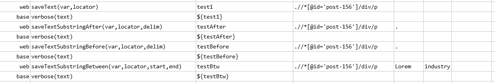
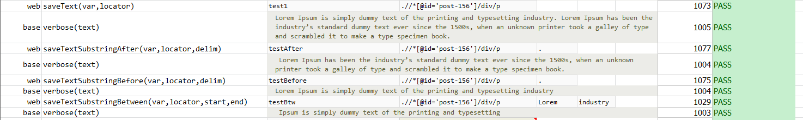

### Description

- This command is to get between text from the defined start and end point of the actual text.
- The command will return the string between start and end point
- The command will return the sub set of the text in between and pass the command or else fail otherwise.

### Parameters

- **var** - this parameter is to store the return value of the command.
- **locator** - this parameter is locator of the element
- **start** - this parameter is start point of the text.
- **start** - this parameter is end point of the text.

### Example
**Script**: 

**Output**: 

### See Also

- [`saveTextSubstringBefore(var,locator,delim)`](saveTextSubstringBefore(var,locator,delim))
- [`saveTextSubstringAfter(var,locator,delim)`](saveTextSubstringAfter(var,locator,delim))