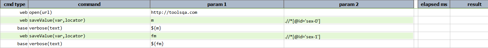
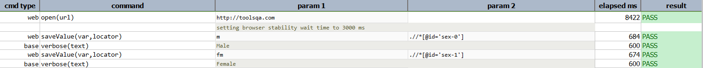

### Description
This command is to save the value of a web form element, such as text box, text area, dropdown, checkbox, radio button 
and button.  This "value" mentioned here is equivalent to the "value" attribute of the corresponding form element 
identified via the specified `locator`.

### Parameters

- **var** - this parameter is to store the value of the attribute.
- **locator** - this parameter is the locator of the element.

### Example

**Script**: 

**Output**: 

### See Also
