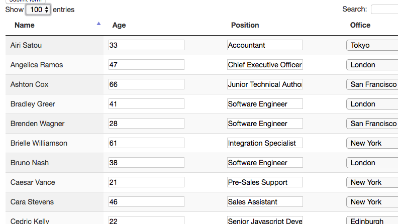
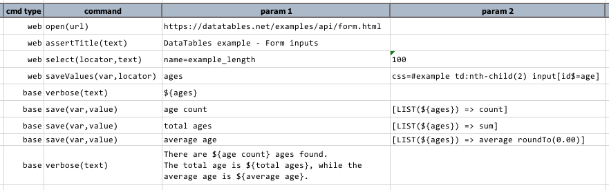
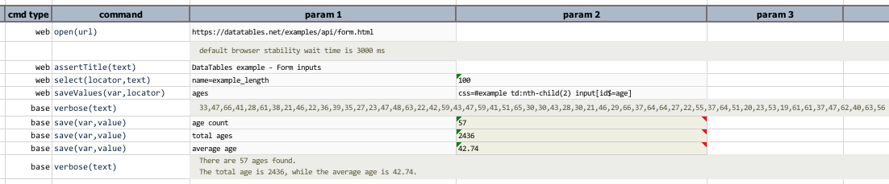

### Description
This command is to save the values of one or more matching web form element, such as text box, text area, dropdown, 
checkbox, radio button and button.  This "value" mentioned here is equivalent to the "value" attribute of the 
corresponding form elements identified via the specified `locator`. Nexial store the collected "values" as a list, from 
which one may use [LIST expression](../../expressions/LISTexpression), [$(array) function](../../functions/$(array)) or
various list-supported commands such as 
[base &raquo; `assertArrayContain(array,expected)`](../base/assertArrayContain(array,expected)) and
[number &raquo; `max(var,array)`](../number/max(var,array)). See example below for more ideas.

### Parameters
- **var** - this parameter is to store the value of the attribute.
- **locator** - this parameter is the locator of the element.

### Example
Suppose the following page: 

We can retrieve the "age" values (second column) like so (the 4th step): 

Here's the output: 

### See Also
- [LIST expression](../../expressions/LISTexpression)
- [$(array) function](../../functions/$(array))
- [base &raquo; `assertArrayContain(array,expected)`](../base/assertArrayContain(array,expected))
- [base &raquo; `assertArrayEqual(array1,array2,exactOrder)`](../base/assertArrayEqual(array1,array2,exactOrder))
- [base &raquo; `assertArrayNotContain(array,unexpected)`](../base/assertArrayNotContain(array,unexpected))
- [number &raquo; `average(var,array)`](../number/average(var,array))
- [number &raquo; `max(var,array)`](../number/max(var,array))
- [number &raquo; `min(var,array)`](../number/min(var,array))
- [web &raquo; `saveValue(var,locator)`](saveValue(var,locator))
