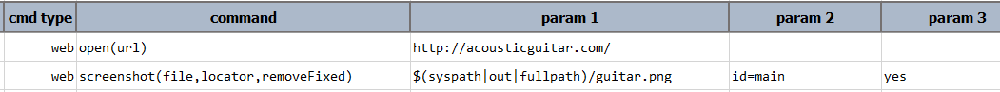
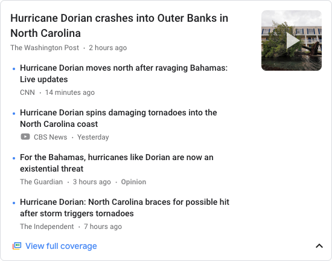

### Description
This command automates the screen capture (to `file`) of a Web element denoted by `locator`. If the `locator` resolves
to multiple web element, then only the first one is considered. If 
[`nexial.outputToCloud`](../../systemvars/index.md#nexial.outputToCloud) System variable is set to `true`, then the 
captured image will be uploaded to the cloud as well.

### Parameters
- **file** - the screen capture saved as a file.
- **locator** - this parameter is the locator of the element.

### Example
Suppose we want to capture element image from news.google.com: 

**Script**: 

**The captured image**: 

### See Also
