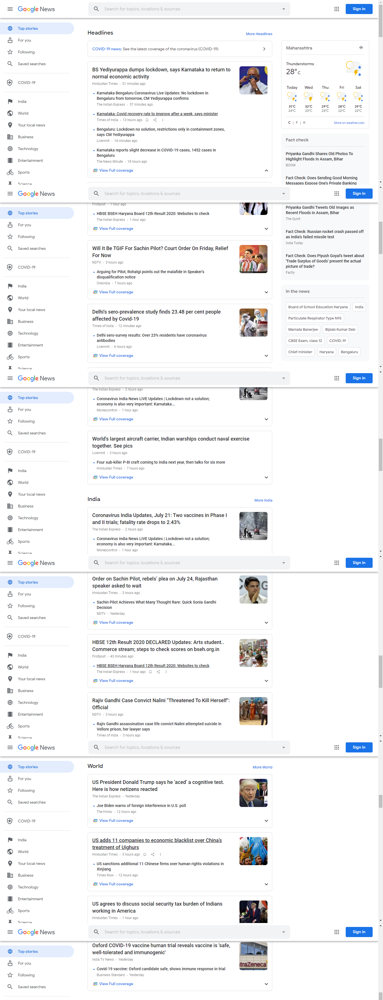
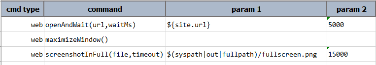
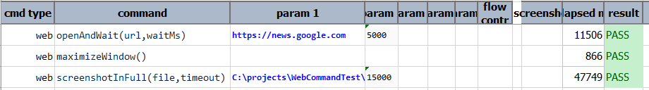

### Description
This command automates the screen capture (to `file`) of a entire web page with timeout between scroll specified by 
`timeout`. The `timeout` is time needed for loading images of web page before scrolling.
If [`nexial.outputToCloud`](../../systemvars/index.md#nexial.outputToCloud) System variable is set to `true`, then the 
captured image will be uploaded to the cloud as well.

### Parameters
- **file** -This parameter is the file path to save entire web page screen capture.
- **timeout** - This parameter is the time (in milliseconds) before scrolling.

### Example
Suppose we want to capture full web page image from news.google.com: 

**Script**: 

**Output**: 

### See Also
- [screenshot(file,locator)](screenshot(file,locator))
