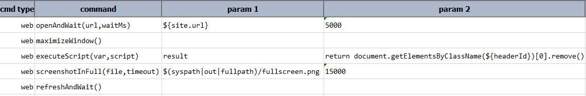

### Description
This command automates the screen capture (to `file`) of a entire web page with timeout between scroll specified by 
`timeout`. The `timeout` is time needed for loading images of web page before scrolling.
If [`nexial.outputToCloud`](../../systemvars/index.md#nexial.outputToCloud) System variable is set to `true`, then the 
captured image will be uploaded to the cloud as well.

Sometimes, while capturing full web page screenshot, user can get persistent headers which will be available on each
screen on scrolling. So, to get rid of those persistent header, user can remove headers temporarily from web page 
using javascript executor before taking full screenshot and put it back for further operation. For example, 

In above example, [WEB &raquo; `executeScript(var,script)`](executeScript(var,script)) command will remove header with 
`headerId`. Then, user can take full screenshot using `screenshotInFull(file,timeout)` command. After screenshot taken,
user can refresh page to go back to original page with header. Like this, user can capture full screenshot without
persistent header.

### Parameters
- **file** -This parameter is the file path to save entire web page screen capture.
- **timeout** - This parameter is the time (in milliseconds) before scrolling.

### Example
Suppose we want to capture full web page image from news.google.com: 

**Script**: 

**Output**: 

**Captured screen**: 

### See Also
- [screenshot(file,locator)](screenshot(file,locator))
