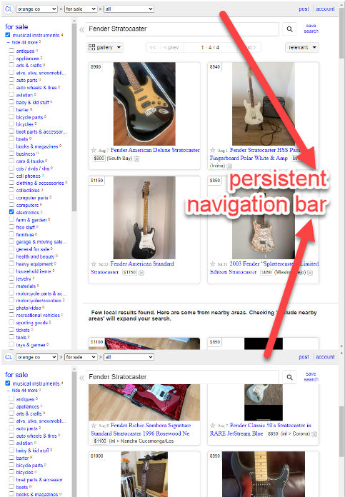
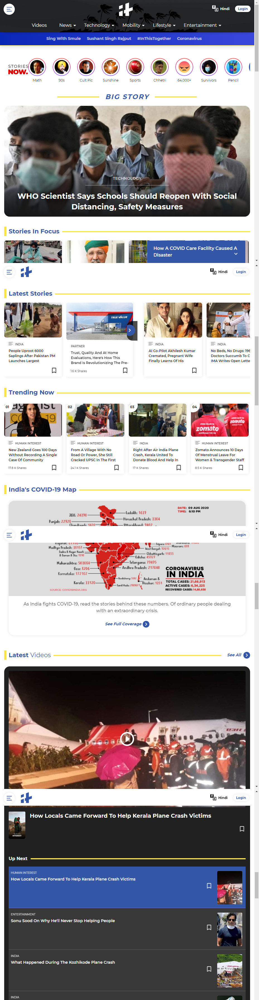

### Description
This command automates the screen capture (to `file`) of a entire web page with timeout between scroll specified by 
`timeout` (in millisecond). The `timeout` is the time needed to load web content and resources (such as images) of the 
current web page before further scrolling. If the web page in question is fully loaded, then it is most likely ok to 
specify a relatively low value for timeout (such as `200` to `500`).

Some web pages might contain persistent (_"sticky"_) navigation elements on the top or bottom of a page. While Nexial 
is scrolling a web page during its screenshot capturing, the persistent element would continue to appear: 

To circumvent such issue, one can specify the `removeFixed` parameter as `true` to activate additional automation in
Nexial. When `removeFixed` parameter is set to `true`, Nexial will attempt to find any existing persistent navigation
(either top or bottom of the page) and disable its positional persistence. After the full page screenshot is complete,
Nexial will restore the page navigation's positional persistence.

This is not always the best approach. Sometimes one would prefer a more customized or fine-grained control over the web
elements instead. For example: 

In above example, [WEB &raquo; `executeScript(var,script)`](executeScript(var,script)) command will remove header with 
`headerId`. Then, user can take full screenshot using `screenshotInFull(file,timeout,removeFixed)` command. After 
screenshot taken, user can refresh page to go back to original page with header.

Note:
- if [`nexial.outputToCloud`](../../systemvars/index.html#nexial.outputToCloud) System variable is set to `true`, then 
  the captured image will be uploaded to the cloud as well.
- screen capturing can be disabled for the entire execution via 
  [`nexial.screenshotEnabled`](../../systemvars/index.html#nexial.screenshotEnabled) System variable.

### Parameters
- **file** -This parameter is the file path to save entire web page screen capture.
- **timeout** - This parameter is the time (in milliseconds) before scrolling.
- **removeFixed** - `true` if Nexial should temporarily disable persistent navigation placements while performing full 
  page screen capturing.

### Example
Suppose we want to capture full web page image from news.google.com: 

**Script**: 

**Captured screen**: 

### See Also
- [screenshot(file,locator,removeFixed)](screenshot(file,locator,removeFixed))
