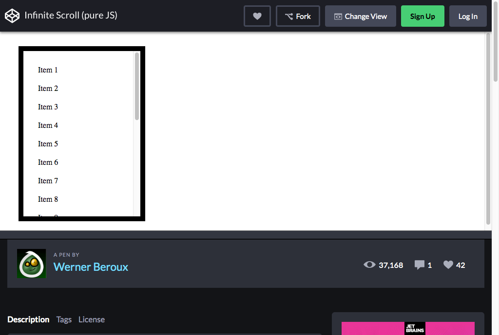
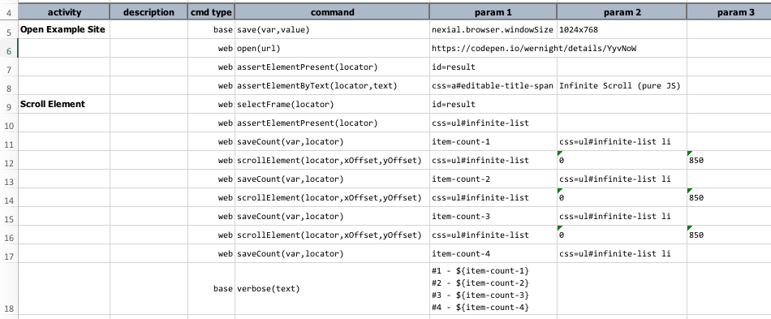

### Description
This command instructs Nexial to scroll the content within a web element (denoted by `locator`) by specified x-offset 
(`xOffset`) and y-offset (`yOffset`) relative to its current position.

Both `xOffset` and `yOffset` represent the relative pixel distance (integer) with which to scroll. For `xOffset`, 
positive value means to scroll right, and negative value means to scroll left. For `yOffset`, positive value means to 
scroll downward, and negative value means to scroll upward. To scroll the target content up and down within its 
container, set `xOffset` to `0`. Similarly, set `yOffset` to `0` if one wish to scroll the target content horizontally.  

One should treat [`scrollElement(locator,xOffset,yOffset)`](scrollElement(locator,xOffset,yOffset)) as the supersede 
of [`scrollLeft(locator,pixel)`](scrollLeft(locator,pixel)) and [`scrollRight(locator,pixel)`](scrollRight(locator,pixel)).

### Parameters
- **locator** - the locator of the target element whose content will be scrolled.
- **xOffset** - the x-offset in pixel (integer) to scroll left (negative) or right (positive).
- **yOffset** - the y-offset in pixel (integer) to scroll up (negative) or down (positive).

### Example
Suppose the following site: 

We can scroll through the items (i.e. `Item 1`, `Item 2`, `Item 3`, etc.) using this command, like this: 

Note that the items mentioned are in an IFRAME (Step 9).

After Step 12, the items scroll downward: 

Similarly for Step 14 and Step 16.

### See Also
- [`assertScrollbarHNotPresent(locator)`](assertScrollbarHNotPresent(locator))
- [`assertScrollbarHPresent(locator)`](assertScrollbarHPresent(locator))
- [`scrollLeft(locator,pixel)`](scrollLeft(locator,pixel))
- [`scrollPage(xOffset,yOffset)`](scrollPage(xOffset,yOffset))
- [`scrollRight(locator,pixel)`](scrollRight(locator,pixel))
- [`scrollTo(locator)`](scrollTo(locator))
