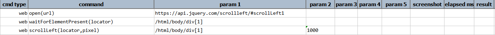
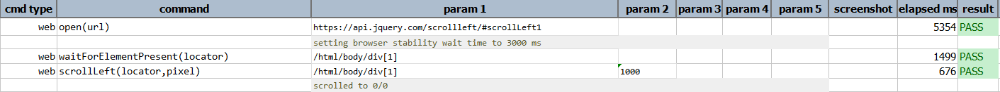

### Description
> **One should treat [`scrollElement(locator,xOffset,yOffset)`](scrollElement(locator,xOffset,yOffset)) as the supersede 
of [`scrollLeft(locator,pixel)`](scrollLeft(locator,pixel)) and [`scrollRight(locator,pixel)`](scrollRight(locator,pixel)).**

- This command is to scroll left of the scroll element.
- In other words the command will scroll left to the defined pixel if element found and will pass the command or else fail otherwise.

### Parameters
- **locator** - this parameter is the locator of the element.
- **pixel** - this parameter is the dimension in pixel to the left of the element identified to be scrolled.

### Example
**Script**: 

**Output**: 

### See Also
- [`assertScrollbarHNotPresent(locator)`](assertScrollbarHNotPresent(locator))
- [`assertScrollbarHPresent(locator)`](assertScrollbarHPresent(locator))
- [`scrollElement(locator,xOffset,yOffset)`](scrollElement(locator,xOffset,yOffset))
- [`scrollPage(xOffset,yOffset)`](scrollPage(xOffset,yOffset))
- [`scrollRight(locator,pixel)`](scrollRight(locator,pixel))
- [`scrollTo(locator)`](scrollTo(locator))
