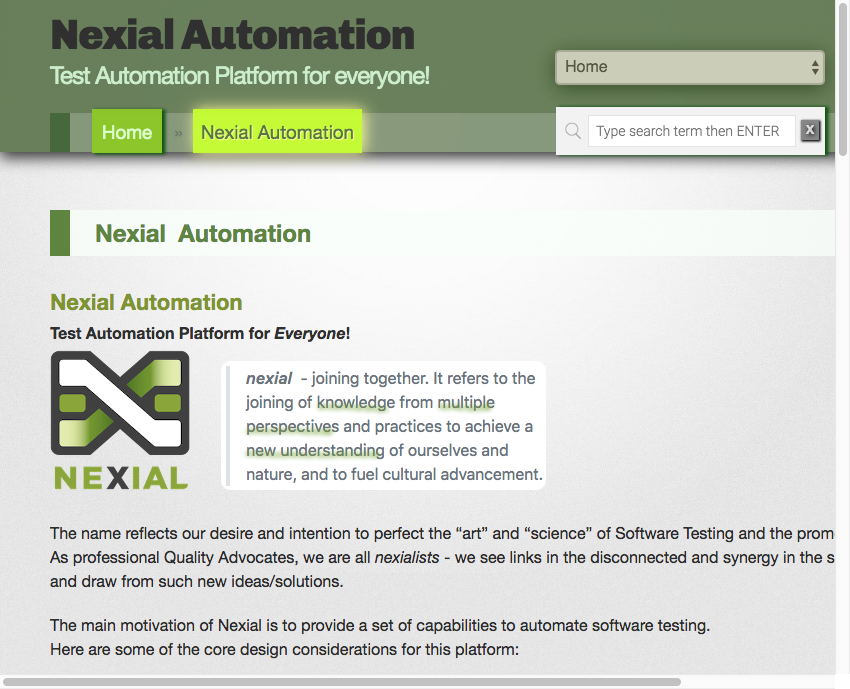
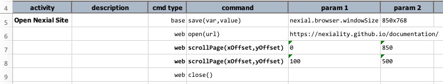
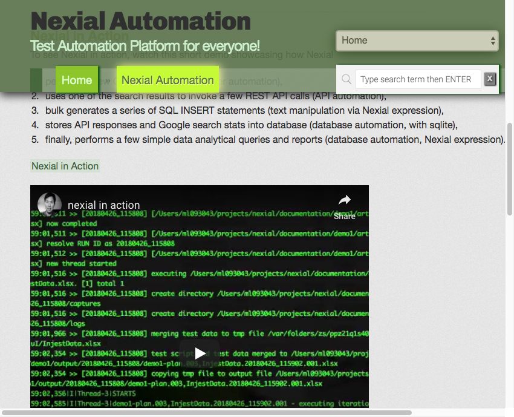
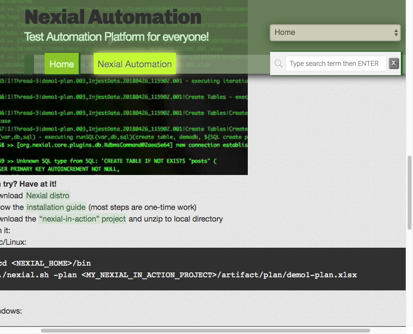

### Description
This command instructs Nexial to scroll the currently active web page by specified x-offset (`xOffset`) and y-offset 
(`yOffset`) relative to current position. 

Both `xOffset` and `yOffset` represent the relative pixel distance (integer) with which to scroll. For `xOffset`, 
positive value means to scroll right, and negative value means to scroll left. For `yOffset`, positive value means to 
scroll downward, and negative value means to scroll upward. To scroll up and down the page, set `xOffset` to `0`. 
Similarly, set `yOffset` to `0` if one wish to scroll the current page horizontally.  

### Parameters
- **xOffset** - the x-offset in pixel (integer) to scroll left (negative) or right (positive).
- **yOffset** - the y-offset in pixel (integer) to scroll up (negative) or down (positive).

### Example
Here's the home page for Nexial Automation: 

The above shows the website displayed in a small-than-usual viewport (850x768 to be exact). We can use this command to
display other parts of this page.

**Script**: 

After Step 7, the page will be scrolled downward: 

After Step 8, the page will be scrolled further downward and slightly right: 

### See Also
- [`assertScrollbarHNotPresent(locator)`](assertScrollbarHNotPresent(locator))
- [`assertScrollbarHPresent(locator)`](assertScrollbarHPresent(locator))
- [`scrollElement(locator,xOffset,yOffset)`](scrollElement(locator,xOffset,yOffset))
- [`scrollLeft(locator,pixel)`](scrollLeft(locator,pixel))
- [`scrollRight(locator,pixel)`](scrollRight(locator,pixel))
- [`scrollTo(locator)`](scrollTo(locator))
