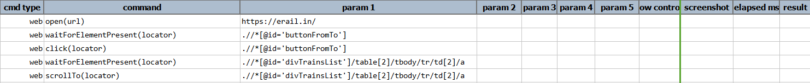
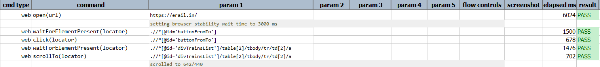

### Description

- This command is to scroll to to desired element.
- In other words this command will scroll to the desired element defined and Pass or else fail otherwise.
- The locator till which the scroll need to be performed has to be defined in input parameters.

### Parameters

- **locator** - this parameter is the locator of the element till which the scroll has to be performed.

### Example

Script: 

Output: 

### See Also

- [`scrollLeft(locator,pixel)`](scrollLeft(locator,pixel))