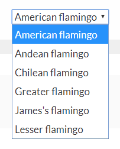
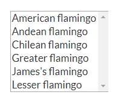
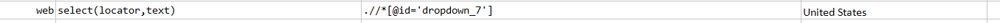
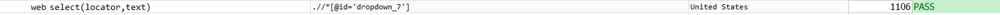
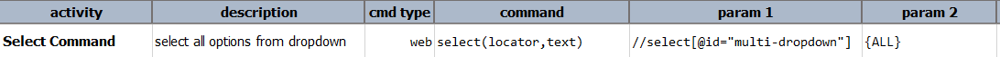

This command automates the selection of `OPTION` element(s) from a `SELECT` element identified via `locator`. The
target `OPTION` element is identified via `text`, which could be plain text for single element identification (i.e. 
exact match) or regex-based element identification (i.e. multi-match). For example, suppose the following `SELECT` 
element:

To select "American flamingo", one would specify `text` as `American flamingo`. However one can also specify `text` as
`REGEX:American.+` (reads: _starts with "American"_).  Similarly, to select "Lesser flamingo", one can specify `text`
as `REGEX:Lesser.+`.

Now suppose we have a `SELECT` element that suppose multi-select:

To select both "Andean flamingo" and "Chilean flamingo", one would specify `text` as `REGEX:.+ean .+` 
(reads: _contains "ean "_).

#### Note
- If multiple matches are found through regex-based identification but the target `SELECT` element only support single 
  selection, then only the first one will be selected.
- If the regex-based identification yielded no matches, then `text` will be retried as exact match. This means Nexial
  will look for a `OPTION` element under the target `SELECT` element that contains the text `REGEX:...`.
- The `REGEX:` capability works for both [`select(locator,text)`](select(locator,text)) and 
  [`deselect(locator,text)`](deselect(locator,text)) command.
- If `text` is `{ALL}` and the target `SELECT` element supports **multi-select**, then `ALL` its `OPTION` elements will be
  **selected.**

### Parameters
- **locator** - the locator of the `SELECT` element.
- **text** - the text to be selected on the `SELECT` element. As said earlier, it supports `Regex:` capability 
            as well as `{ALL}` to select all options.

### Example
**Script**: 

**Output**: 

**Select all the option(multi-select)**: 
**Script**: 

**After selection**: 

### See Also
- [`deselect(locator,text)`](deselect(locator,text))
- [`deselectMulti(locator,array)`](deselectMulti(locator,array))
- [`selectMulti(locator,array)`](selectMulti(locator,array))
- [`selectMultiOptions(locator)`](selectMultiOptions(locator))
- [`type(locator,value)`](type(locator,value))
